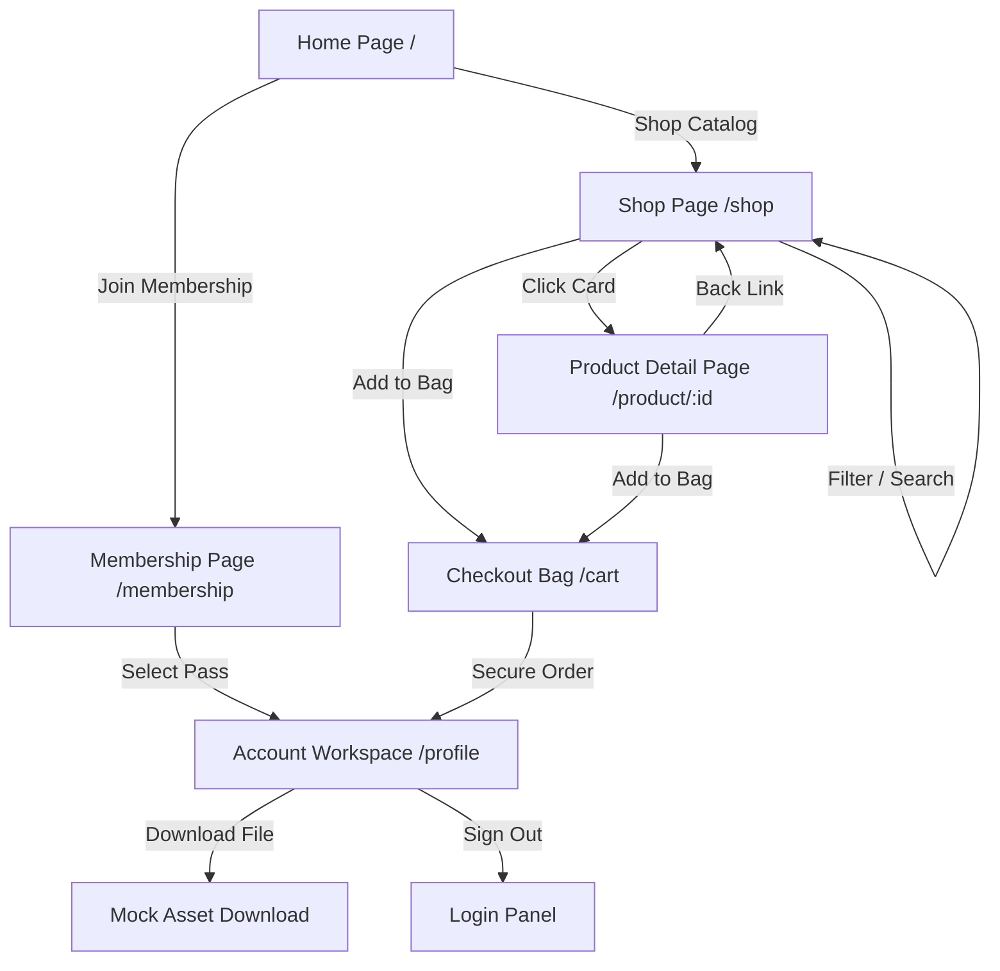

# Dexter Marketplace - Architecture & Navigation Map

Dexter Marketplace is a high-fidelity digital marketing marketplace constructed using a strict Nike-inspired design system. 

## 🗺️ View Navigation Map
The application implements a custom state-based router (`currentView` state) to enable instant page switches with zero loading lag.

---

## 📄 Dedicated Pages Overview

### 1. Homepage (`home`)
* **Features:** Full-bleed primary campaign hero promoting high-performance ads and automation kits; horizontal scrolling track list (swapping tracks like track & field to advertising tracks); trending grid releases; second campaigns rail; and a membership promotion block.
* **Aesthetics:** White canvas, clean layout typography (`Bebas Neue` display headers), and photography-first product covers.

### 2. Shop Listing Page (`shop`)
* **Features:** Left filter sidebar layout featuring resource type checkboxes and marketing categories; responsive toggle control to show/hide filters; sorting menu options (Price, Popularity, Ratings); and dynamic product tiles.
* **Interactivity:** Concentric swatch dots on the product cards let users preview variant styles and add specific variant configurations directly to the cart bag.

### 3. Product Detail Page (`pdp`)
* **Features:** Full-page presentation layout. Dual columns displaying a thumbnail switcher on the left and comprehensive pricing, rating, variant swatches, and actions on the right.
* **Disclosures:** Includes custom Nike-style disclosure rows (accordions) for *Asset & Curriculum Overview*, *Licensing Terms*, and *Delivery & Help desk*.

### 4. Apex Membership Page (`membership`)
* **Features:** Dark mode full-bleed introductory promo card; 3-column comparative pricing pricing grid (*Starter Pass*, *Apex Pro Pass*, *Agency All-Access*); and interactive FAQ accordions.
* **Interactivity:** Selecting a subscription tier automatically updates the user state to member status and unlocks downloads.

### 5. Checkout Bag Page (`cart`)
* **Features:** Lists selected items with custom quantity selectors, price subtotal updates, secure payment inputs (simulated billing form), and order validation.
* **Success State:** Unlocks downloads on completion and redirects the user to their dashboard.

### 6. Account Workspace Dashboard (`profile`)
* **Features:** Displays active login details, member level, and two interactive grids:
  1. **Your Digital Files:** Features instant download actions for all purchased assets (and all 16 vault assets if user is an active Pro or Agency member).
  2. **Your Wishlist:** A sidebar list showing saved items with single-click bag adding and removal options.
